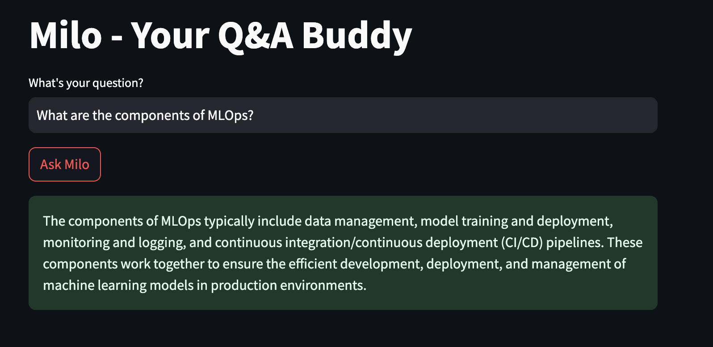
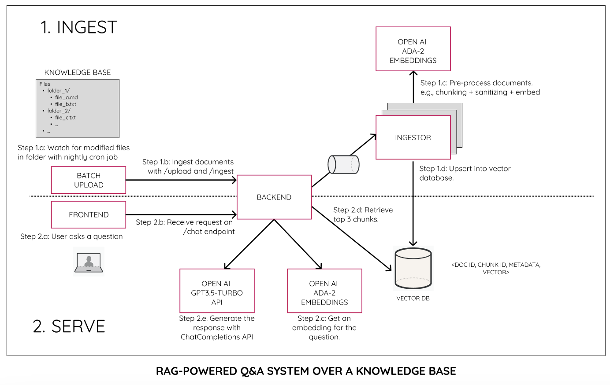

# Building a RAG-powered Knowledge Base
In this project, we'll see what a scalable architecture for a knowledge base with RAG looks like. We'll assume that we start with a KB of text/markdown files (Other document formats can be extracted or converted to this format so that the LLM can understand it)

## The App
Our demo app will be a chatbot called Milo that can help answer questions based on MLOps community blogs.



For simplicity, we'll assume that these blogs have already been exported to a folder structure (your pipeline for getting this might differ - for example, you may export it directly from your KB, or might crawl your blog site). We'll start from that folder and upload documents using an uploader job (your upload triggers might be different).

Also, we use streamlit for the front-end to keep our scope to the back-end. In production, you might have a much more refined front end with user authentication, etc.

## The Architecture
The figure below shows the architecture and the two main processes we have - ingesting documents from the files KB to the vector store; and Q&A over the vectordb.



We'll be using a containerized approach in combination with Docker Compose for the spinning these up.


## Setting up common services for platform

1. In `common/` create a `.env` file for the services:
```sh
MINIO_ROOT_USER="minio"
MINIO_ROOT_PASSWORD="password"
MINIO_REGION="us_1"
S3_ACCESS_KEY_ID="access_key_id"
S3_SECRET_ACCESS_KEY="secret_access_key"
REDIS_PASSWORD="password"
CHROMA_SERVER_AUTH_CREDENTIALS="chroma-token"
CHROMA_SERVER_AUTH_CREDENTIALS_PROVIDER="chromadb.auth.token.TokenConfigServerAuthCredentialsProvider"
CHROMA_SERVER_AUTH_PROVIDER="chromadb.auth.token.TokenAuthServerProvider"
```

2. Create the network so that services in other files can access these
```sh
docker network create --driver bridge my-network
```
4. Start the services
```sh
cd common
docker compose up
```
CTRL+C (maybe twice on codespaces) when you've confirmed everything is working as expected.

5 When you're sure it all works:
```sh
docker compose up -d
```

And see what's working:
```sh
docker ps
```

You should see something like:
```
CONTAINER ID   IMAGE         COMMAND                  CREATED         STATUS         PORTS                                       NAMES
7223d96460b5   minio/minio       "/usr/bin/docker-ent…"   9 minutes ago    Up 9 minutes              0.0.0.0:9000->9000/tcp, :::9000->9000/tcp   minio
e4a2d563de01   redis             "docker-entrypoint.s…"   9 minutes ago    Up 9 minutes              0.0.0.0:6379->6379/tcp, :::6379->6379/tcp   redis
```

6. To turn it off
```sh
docker compose down
```


## Setting up backend
1. In backend folder create the .env file
```sh
S3_URL="minio:9000"
S3_REGION="us_1"
S3_ACCESS_KEY_ID="access_key_id"
S3_SECRET_ACCESS_KEY="secret_access_key"
S3_SECURE="false"
S3_BUCKET_NAME="data"
REDIS_URL="redis:6379"
REDIS_DB="0"
REDIS_PASSWORD="password"
OPENAI_API_KEY="YOUR_OPENAI_KEY"
CHROMA_URL="chroma"
CHROMA_PORT="8000"
CHROMA_AUTH_TOKEN="chroma-token"
```


2. Start the backend
```sh
cd backend
docker compose up --build -d
```


# Starting build-index ingestor queues
1. Create the env var file in `build-index/`
```sh
S3_URL="minio:9000"
S3_REGION="us_1"
S3_ACCESS_KEY_ID="access_key_id"
S3_SECRET_ACCESS_KEY="secret_access_key"
S3_SECURE="false"
S3_BUCKET_NAME="data"
REDIS_URL="redis:6379"
REDIS_DB="0"
REDIS_PASSWORD="password"
OPENAI_API_KEY="YOUR_OPENAI_KEY"
CHROMA_SERVER_AUTH_CREDENTIALS="chroma-token"
```

2. Start the queue ingestor.
```sh
cd build-index
docker compose up --build
```

It will ingest the data you send in the next step

# Run Batch Upload
1. Create the .env file in the `batch-upload/` folder

```
BACKEND_URL="http://backend:8080"
```

2. Start the batch upload script. It uploads everything under `files/` folder with it's foldername and filename preserved (only one level for this workshop).
```sh
cd batch-upload
docker compose up --build
```

# Running the Q&A App
1. Go to the `milo/` folder

2. Make sure you install dependencies:
```sh
pip install -r requirements.txt
```

3. Run the app
```sh
streamlit run milo.py
```

4. Ask your mlops questions from the database.
